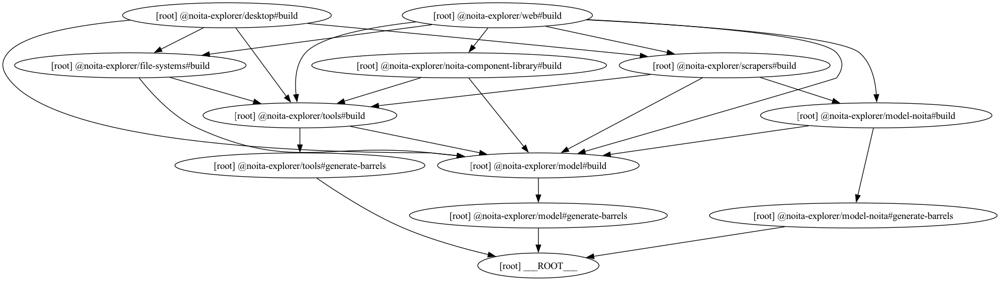

# Noita Explorer

Welcome to **Noita Explorer**!

Have you lost your unlocked perks, spells or enemies progress recently? 
Or would you like to just check what you haven't unlocked yet? Are you
interested in a map visualizing your death locations? Or to check statistics of
your previous sessions? 

You are at the perfect place!

Website: https://noita-explorer.pages.dev/
Dev website: https://dev.noita-explorer.pages.dev/

## Disclaimer

Noita Explorer is a free, ad-free, open-source and fully client side tool to unlock perk, 
spell and enemy progress.
It achieves it without mods, by directly modifying your save files. 
While I've tested the features that modifies files as thoroughly as I could, it is software after all, 
and anything that can go wrong will go wrong one day. 
Therefore, it is YOUR responsibility (and highly advised) to create a backup of your game
files before using this tool. 
I do not take any responsibility if this tool breaks your save files and the previous 
version cannot be restored!


## Features

### Features - Browser version

- Progress: View your in-game progress of the unlocked items
- [*] Progress: Unlock any perk, spell or enemy, without mods (achievements still work)!
- [WIP] Wiki: An auto generated wiki from the data.wak file.
- [WIP] Current run: View details of your current run.
- Holidays: View the upcoming holidays, sorted by the event's date
- Sessions: View all your sessions and statistics about it. Filter by what killed you :D
- Death map: An interactive death map, using plotly.js
- Bones wands: Inspect the wands stored in the bones wands files. 
- [*] Bones wands: Delete any or all bones files from your disk.
- Settings: 
  - Units / Time: The default option chooses the time unit that fits the context the best. Though you can force the time unit to be either frames or seconds throughout the app.
  - Cursor / Type: A bit buggy, but you can customize your cursor to be more Noita like! I'll plan to investigate the rendering issue with the custom cursor
  - Extras / Display debug info: Reveals the collected debug information during the scraping of the data.wak, such as tags for enemies, scraped files. Currently only a limited amount of debug information is collected.

Features marked with a [*] star are only available in browser that support the [File System API](https://caniuse.com/native-filesystem-api).
At the moment writing this README, only these browser do maintain a support:
- Chrome: 105 - current
- Edge: 105 - current
- Opera: 91 - current

### Features - Desktop version

The desktop app is a work in progress, but eventually it is planned to be released.

- Everything from web, plus:
- Launch the Noita game
- Launch the Noita game with different sets of arguments
- Scrape data.wak file
- Open folders and files in the client's operating system's file explorer


### Feature request / Bug report

Do you have an idea that you would like to see in Noita Explorer? Or have you encountered
a bug? Feel free to open an issue for it!


## Running the project locally

### Setup

1. Clone the repository

```shell
git clone https://github.com/gergo-nador/noita-explorer.git
```

2. Install dependencies

```shell
npm install
```

3. Create an environment file in the path `apps/web/.env` with the following content:

```dotenv
VITE_ENV=development
```

(`VITE_ENV` will resolve to `preview` in the development deployment, and `production` in production deployment)

### Running the Website development server

1. Run development server

```shell
npm run dev:web
```

2. Visit https://localhost:4000 in your preferred browser

### Running the Electron app

1. Run electron startup script
```shell
npm run dev:desktop
```

Note: only tested this on Windows


## Branches and Environments

Since I'm the only one developing this project, and I don't expect any contributors
in the near future, I've come up with this simple structure:

### Environments (`import.meta.env.VITE_ENV`)

- on local machine: `development`
- on preview deployment from `dev` branch: `preview`
- on production deployment from `main` branch: `production`

### Branches

- `dev`: active development branch. Mainly a beta testing branch. New features can be broken.
  - deployed: https://dev.noita-explorer.pages.dev/
- `main`: main production branch. If a feature is well tested in the `dev` branch, it will be merged into this one.
  - deployed: https://noita-explorer.pages.dev/


## Project structure

As you may have noticed, this repository consists of two applications,
an Electron desktop app, and a browser based app. While the electron 
runs the browser app internally, they still need different logic, especially
in the file handling. Therefore it was decided to separate them into projects.

After a lot of research the choice was made to use [Turborepo](https://turborepo.com/)
as a build system.

The project is structured in the following way:

- Apps
  - `apps/desktop`: Electron app
  - `apps/web`: Browser app

- Packages
  - `packages/model`: Base helper interfaces, not related to Noita
  - `packages/model-noita`: Types for Noita
  - `packages/tools`: General tools and utility functions
    - `src/common`: General utility functions
    - `src/lua`: Wrapper around `luaparse` package
    - `src/xml`: Wrapper around `xml2js` parsed object structure
    - `tests/xml`: Unit tests for the xml 
  - `packages/file-systems`: File system access is abstracted in this project for flexibility (interfaces in `packages/model/src/file-system`)
    - `src/browser-fallback`: Fallback file using `browser-fs-access` for cases when the File System API is not available
    - `src/browser-file-access-api`: File system used when File System API is available
    - `src/data-wak-memory-filesystem`: Read files directly from the data.wak compressed file without unpacking it
    - `/apps/desktop/src/file-system`: Node implementation of the file system access interfaces
  - `packages/scrapers`: All functions related to scraping and modifying Noita files 
    - `src/actions`: Actions that modify the save files.
    - `src/scrapers`: Functions to scrape data from data.wak or save00 folder. These functions don't modify any files on the disk
  - `noita-component-library`: Reusable Noita components without Noita logic
    - run `npm run dev:storybook` to view the components (not finished)

Dependency Graph:

(generated with `turbo run build --graph --dry | dot -Tpng -oturbo-graph.png`)
(`dot` is from `brew install graphviz`)


## Error Tracking and Reporting (Sentry)

[Sentry](https://sentry.io/welcome/) was added to the project for error reporting.
Error reporting to Sentry is disabled by default. When a user visits the page 
for the first time, a popup will be shown to ask the user to opt-in to enable Sentry. 

Enabling/Disabling Sentry error reporting can be also achieved in the Settings 
page under the Extras.

Sentry logging is only enabled in the deployed pages, both in production and 
preview environments. It is disabled in development. Please don't enable it
locally and don't spam the Sentry issues board.