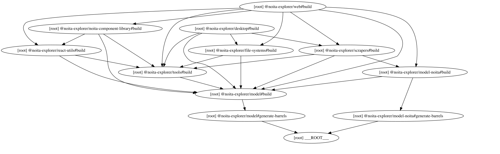

# Noita Explorer

Welcome to **Noita Explorer**!

Have you recently lost your unlocked perks, spells or enemies progress? 
Or you are just here to just check what's still unlocked? 
Are you interested in a map of your death locations? 
Or to check statistics of your previous sessions? 

You are at the perfect place!

Check out our deployed website: https://noita-explorer.com

## Disclaimer

Noita Explorer is a free, ad-free, open-source and fully client side tool to unlock perks, spells and enemy progress.
Unlocking these resources is done by directly modifying your save files (without mods). 
While many features have been tested, it is highly advised and is your responsibility to create a backup of your game
files before using this tool. Features that modify the game files are called "actions". When a user wants to run an action,
the action is first pushed into a preview queue, where the user has an overview of all the actions that will be run.

Use at your own risk. We strongly recommend backing up your save files before use. We are not liable for any potential data loss or file corruption.

## Features

Before many of these features, you need to give access to your noita save folder. You can do so in the "Setup" menu item.

### Features - Browser version

#### Without access to Noita save folder

- [Progress > Show all]: View all unlockable perks, spells and enemies
- [Progress > Secrets]: View available orbs
- [Progress > Secrets > Achievement Pillar]: View all achievement pillars

- [Wiki]: Filter, view details, share the perks, spells and enemies (auto generated from the data.wak file)
- [Wiki > Materials]: Work in progress

- [Holidays]: View in-game holidays and their next start date

- [Settings > Units]: Choose your preferred time unit:
  - Default: automatically chosen
  - Frames: forces all time units to be in frames
  - Seconds: forces all time units to be in seconds
- [Settings > Cursor]: Pick your cursor type (a bit broken, needs a fix)

#### With read access to Noita save folder

!! It's important you select the NollaGamesNoita folder and not the save00 !!

- [Progress]: View your unlocked (and newly unlocked) perks, spells and enemies
- [Progress > Secrets]: Inspect the unlocked player decorations
- [Progress > Secrets]: Check out picked up orbs in the current game
- [Progress > Secrets > Achievement Pillar]: View unlocked achievement pillars
- [Sessions]: View statistics of your previous Noita sessions, filter by many options
- [Death map]: A map of all* the places where you died *(limited to the main world)
- [Bones wands]: See the bones wands, that can come back in your future runs in a hand of the Kummitus

#### With write access to Noita save folder

- [Progress > Unlock Mode]: Unlock perks, spells or enemies individually or in all of them
- [Progress > Secrets]: Unlock player cosmetics (permanently or for the current game), such as the crown, amulet or the amulet gem
- [Progress > Secrets > Achievement Pillar]: Unlock achievement pillars
- [Bones wands]: Delete any or all bones wands

Features that require write access to the Noita save folder are only available in browsers that support the [File System API](https://caniuse.com/native-filesystem-api).
You can check if your browser supports it here: https://caniuse.com/native-filesystem-api

### Features - Desktop version

The desktop app is a work in progress.

- Everything from web, plus:
- Launch the Noita game
- Launch the Noita game with different sets of arguments
- Scrape data.wak file
- Open folders and files in the client's operating system's file explorer

Warning: The desktop features have been unmaintained for a while, probably it is unstable, run it at your own risk.


### Feature request / Bug report

Do you have an idea that you would like to see in Noita Explorer? Or have you encountered
a bug? Feel free to open an issue for it!


## Running the project locally

### Setup

1. Clone the repository

```shell
git clone https://github.com/gergo-nador/noita-explorer.git
```

2. Install dependencies

```shell
npm install
```

3. Create an environment file in the path `apps/web/.env` with the following content:

```dotenv
CI_DATA_WAK_URL=https://storage.noita-explorer.com/data.wak
CI_TRANSLATIONS_URL=https://storage.noita-explorer.com/common.csv
# skips generating static assets for the website
CI_DISABLED=0
# skips generating static pages (not needed for development)
CI_SSG_DISABLED=1
# skips any CI task that requires internet access (scraping the noita.wiki.gg links)
CI_INTERNET_DISABLED=1
# VITE_ENV is set to "production" in the deployed main branch
# and is set to "preview" in the deployed non-main branches
VITE_ENV=development
```

### Running the Website development server

0. If you are running the website for the first time, run the build script with the `CI_DISABLED=0`

Important: running the build script with `CI_DISABLED` not equal to `1` will download the `data.wak` and `common.csv` 
files from the noita-explorer's hosted storage. More about this in the CI section.

```shell
npm run build
```

(later you can set the `CI_DISABLED` to back to `1`)

1. Run development server

```shell
npm run dev:web
```

2. Visit https://localhost:4000 in your preferred browser


## Branches and Environments

### Environments (`import.meta.env.VITE_ENV` or `__ENV__`)

- on local machine: `development`
- on preview deployment from `dev` branch: `preview`
- on production deployment from `main` branch: `production`

### Branches

- `dev`: active development branch. Mainly a beta testing branch. New features can be broken.
  - deployed: https://dev.noita-explorer.com
- `main`: main production branch. If a feature is well tested in the `dev` branch, it will be merged into this one.
  - deployed: https://noita-explorer.com


## Project structure

[Turborepo](https://turborepo.com/) is used as a build system.

The runnable applications are in the `/apps` folder, the re-usable packages
are in the `/packages` folder.

The project is structured in the following way:

- Apps
  - `apps/desktop`: electron app (not maintained, not published)
  - `apps/web`: website (published)

- Packages
  - `packages/model`: Base interfaces
  - `packages/model-noita`: Interfaces and types related to Noita
  - `packages/tools`: General tools and utility functions
    - `src/common`: General utility functions
    - `src/lua`: Wrapper around `luaparse` package
    - `src/xml`: Wrapper around `xml2js` parsed object structure
    - `tests/xml`: Unit tests for the xml 
  - `packages/file-systems`: File system access is abstracted in this project for flexibility (interfaces in `packages/model/src/file-system`)
    - `src/browser-fallback`: Fallback file using `browser-fs-access` for cases when the File System API is not available
    - `src/browser-file-access-api`: File system used when File System API is available
    - `src/data-wak-memory-filesystem`: Read files directly from the data.wak compressed file without unpacking it
    - `src/node`: Node implementation of the file system access interfaces
  - `packages/scrapers`: All functions related to scraping and modifying Noita files 
    - `src/actions`: Actions that modify the save files.
    - `src/scrapers`: Functions to scrape data from data.wak or save00 folder. These functions don't modify any files on the disk
  - `packages/react-utils`: Reusable react components and utility functions/hooks
  - `packages/noita-component-library`: Reusable Noita components
    - run `npm run dev:storybook` to view the components (not finished)

Dependency Graph:

generated with `npm run generate-dep-graph`


## Hosting

The `apps/web` react app is hosted on Cloudflare Pages.

The official domains of Noita Explorers are:
- https://noita-explorer.com or https://www.noita-explorer.com (main branch)
- https://dev.noita-explorer.com (dev branch)

Access site directly:
- https://noita-explorer.pages.dev (main branch direct cloudflare link)
- https://dev.noita-explorer.pages.dev (dev branch direct cloudflare link)

## CI

The `apps/web` project contains scripts that automatically run when the project is build.
These scripts prepare static assets for the website to work. 
As these assets are required for the web app to work, the scripts are needed to be run initially, but later 
can be disabled by setting the `CI_DISABLED` environment variable to `1`

Here is a breakdown of what happens when the `apps/web` project is built:

### `prebuild`

The prebuild runs the `scripts/ci.sh` shell file. 
This file will 
1. import and set all the environment variables which can be found in the `.env` file
2. check if `CI_DISABLED` flag is `1`, if yes, exit with code `0`
3. type checking for typescript files in the scripts folder
4. build `apps/web` as a library in `dist-lib` folder for the scripts
5. `npm run data-wak-download`: downloads the `data.wak` and the `common.csv` from the urls in `CI_DATA_WAK_URL`
and `CI_TRANSLATIONS_URL`. These files are hosted on cloudflare. If you wish to skip downloading them, copy these files from the
game directory into the `dist-tmp` folder.
6. `npm run scrape-data-wak`: scrapes the previously downloaded `data.wak` file for perk, spell and enemy data, for
media files. Outputs two json files, the `public/noita_wak_data.json` contains the metadata of many in-game objects. The
second one is placed in `dist-tmp/noita_data_gifs.json`, it contains all the gifs in base64 encoded format.
7. `npm run generate-gifs`: generates gifs from the file `dist-tmp/noita_data_gifs.json` and outputs them in the `public` folder
8. `npm run generate-static-assets`: generates SEO optimized HTML pages for the sharing wiki links
9. `npm run generate-sitemap`: generates sitemap for SEO

### `postbuild`

If the `SENTRY_AUTH_TOKEN` environment variable is present (it should only be present in the CI pipelines, not locally),
it will upload the source maps to Sentry. After the uploading has completed, the source maps are deleted.


## Error Tracking and Reporting (Sentry)

[Sentry](https://sentry.io/welcome/) was added to the project for error reporting purposes.
Error reporting is disabled by default. When a user visits the page 
for the first time, a popup will be shown to ask the user to opt-in to enable Sentry. 

Enabling/Disabling Sentry error reporting can be done in the Settings 
page under the Extras.

Sentry logging is only enabled in the deployed pages, both in production and 
preview environments. It is disabled in development. Please don't enable it
locally and don't spam the Sentry issues board <3